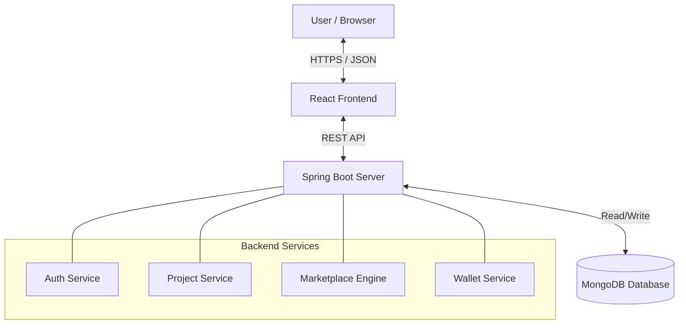

# Carbon Credit Trading Platform
## User Manual & System Report

---

### 1. Introduction
**What is a Carbon Credit?**
Imagine the Earth has a limit on how much smoke (carbon dioxide/CO₂) it can handle. A **Carbon Credit** is like a permission slip that allows a company to emit a certain amount of CO₂.
- **1 Carbon Credit = 1 Tonne of CO₂ removed or avoided.**

**Why does it matter?**
Some companies produce a lot of CO₂ (like factories). Others work to remove it (like solar farms or tree planters).
- **Producers** (Factories) need to buy credits to offset their pollution.
- **Reducers** (Solar Farms) earn credits for saving the environment and can sell them to make money.

**What does this platform do?**
This platform is a **Marketplace** where these two groups meet.
1.  **Green Projects** (Solar/Wind) sign up and get verified.
2.  The system gives them **Digital Credits**.
3.  **Polluters** buy these credits using real money.
4.  The platform handles the **Trading**, **Wallet**, and **Verification** securely.

---

### 2. System Features

#### 2.1 User Registration & Login
- **Security**: Uses **JWT (JSON Web Token)**. When you log in, you get a secure digital key. You don't need to enter your password for every click; the key proves who you are.
- **Roles**:
    - **User**: Can submit projects, buy/sell credits, and manage their wallet.
    - **Admin**: Can verify projects, view all users, and manage the platform.

#### 2.2 Environmental Projects
- Users can submit projects (e.g., "Rajasthan Solar Park").
- **Types**:
    - **Reducing**: Solar, Wind, Reforestation (These *earn* credits).
    - **Producing**: Manufacturing, Industrial Burning (These *buy* credits).
- **Status**: Starts as `PENDING`. Must be `VERIFIED` by an Admin to generate credits.

#### 2.3 Verification System
- A critical step to prevent fraud.
- **Process**: An Admin reviews the project details.
- **Action**: When an Admin clicks "Verify", the system automatically calculates and issues carbon credits to the project owner's wallet.

#### 2.4 Carbon Credit Generation
- **Formula**: `1 Credit = 1 Tonne CO₂`.
- **Automation**: Credits are generated *only* when a project is verified.
- **Example**: If a Solar Project saves 1000 Tonnes of CO₂, the owner instantly gets 1000 Credits in their digital wallet.

#### 2.5 Marketplace Trading
- A stock-market-like exchange for credits.
- **Buy Orders**: "I want to buy 10 credits for $50 each." (Money is locked).
- **Sell Orders**: "I want to sell 10 credits for $50 each." (Credits are locked).
- **Matching**: The system automatically finds matching buyers and sellers.
- **Dynamic Pricing**: To prevent manipulation, you can only set prices within **±10%** of the last traded price.

#### 2.6 Wallet System
- A digital bank account built into the platform.
- **Balances**:
    - **Cash Balance**: Money used to buy credits.
    - **Credit Balance**: The number of carbon credits you own.
- **History**: Shows every transaction (e.g., "Sold 50 credits", "Retired 10 credits").

#### 2.7 Credit Retirement
- When a company uses a credit to claim they are "Carbon Neutral", that credit must be destroyed so it can't be sold again.
- **Action**: The "Retire" button permanently removes credits from the wallet.

---

### 3. Step-by-Step Usage Guide

#### Step 1: Sign Up
1.  Go to the **Register** page.
2.  Enter your Name, Email, Password, and Role (User).
3.  Click **Sign Up**. You will be redirected to Login.

#### Step 2: Add Funds (Simulation)
1.  Go to **Wallet**.
2.  You will see your Cash and Credit balances.
3.  (In a real app, you'd use a credit card. Here, we simulate adding funds for testing).

#### Step 3: Submit a Project (For Sellers)
1.  Go to **My Projects** -> **Create New**.
2.  Fill in details: Name ("Wind Farm A"), Type ("Wind"), Location, and CO₂ Savings (e.g., 500).
3.  Click **Submit**. Status will be `PENDING`.

#### Step 4: Verify Project (For Admins)
1.  Log in as Admin.
2.  Go to **Dashboard** or **Projects List**.
3.  Find the `PENDING` project.
4.  Click **Verify**.
5.  *Result*: The project owner now has 500 Credits in their wallet.

#### Step 5: Trade Credits
**To Sell:**
1.  Go to **Trading**.
2.  Enter Quantity (e.g., 10) and Price (e.g., $100).
3.  Click **Sell**. Your credits are locked.

**To Buy:**
1.  Go to **Trading**.
2.  Enter Quantity (e.g., 10) and Price (e.g., $100).
3.  Click **Buy**. Your money is locked.
4.  *Result*: If prices match, the trade executes instantly. Money goes to the seller; credits go to the buyer.

---

### 4. System Architecture

#### Technology Stack
- **Frontend**: React.js (User Interface), Tailwind CSS (Styling).
- **Backend**: Java Spring Boot (Logic, API, Security).
- **Database**: MongoDB (Stores Users, Projects, Orders, Wallets).

#### High-Level Architecture Diagram

#### Data Flow: Buying a Credit
1.  **User** clicks "Buy" on Frontend.
2.  **Frontend** sends `POST /api/marketplace/orders` to Backend.
3.  **Backend** (Wallet Service) checks if User has enough money.
4.  **Backend** locks the money.
5.  **Marketplace Engine** checks for a matching Sell Order.
6.  **If Match Found**:
    - Money moves from Buyer -> Seller.
    - Credits move from Seller -> Buyer.
    - Trade is recorded in Database.
7.  **Backend** responds "Order Placed/Executed".

---

### 5. Technical Details (For Developers/Professors)

#### Database Schema (MongoDB)
- **Users**: `id`, `email`, `password` (hashed), `roles`.
- **Projects**: `id`, `ownerId`, `type`, `status`, `totalCredits`.
- **Wallets**: `userId`, `balance`, `creditBalance`, `transactions[]`.
- **Orders**: `id`, `type` (BUY/SELL), `price`, `quantity`, `status` (PENDING/EXECUTED).
- **Trades**: `id`, `buyerId`, `sellerId`, `price`, `timestamp`.

#### Key API Endpoints
| Method | Endpoint | Description |
| :--- | :--- | :--- |
| `POST` | `/api/auth/signin` | Login and get JWT. |
| `POST` | `/api/projects` | Submit a new project. |
| `PUT` | `/api/projects/{id}/verify` | Admin verifies project & issues credits. |
| `POST` | `/api/marketplace/orders` | Place a Buy or Sell order. |
| `GET` | `/api/wallet` | Get current balance and history. |

#### Real-Life Analogy
Think of this platform like a **Video Game Exchange**:
- **Credits** are like "Game Items" you find (generate) by playing (doing green projects).
- **Wallet** is your Inventory.
- **Marketplace** is the Auction House where you sell items for Gold (Money).
- **Admins** are the Game Masters who make sure you actually found the item and didn't cheat.

---

### 6. Common Errors & Solutions

| Error | Cause | Solution |
| :--- | :--- | :--- |
| **401 Unauthorized** | You are not logged in or your session expired. | Log out and log in again. |
| **"Insufficient Funds"** | You are trying to buy credits but your Cash Balance is too low. | Add funds to your wallet. |
| **"Price out of range"** | You set a price too high or too low compared to the market. | Set a price within ±10% of the last trade. |
| **Project not verifying** | Only Admins can verify projects. | Log in with an Admin account. |

---

### 7. Conclusion
The **Carbon Credit Trading Platform** provides a transparent, secure, and efficient way to incentivize green energy. By digitizing carbon credits and automating the trading process, it makes it easier for the world to move towards a net-zero future.
